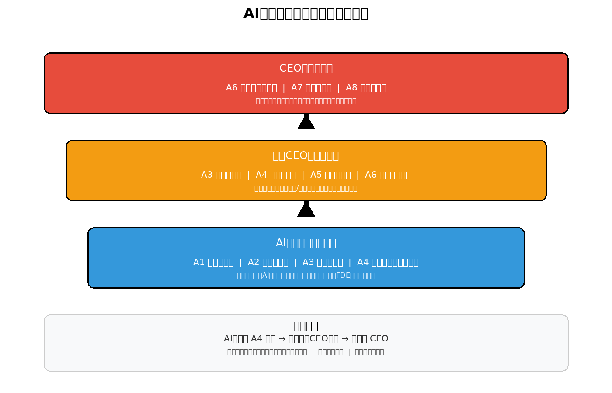

# AI作战队伍组织方案（研发类）

> **汇报对象**：董事长  
> **版本**：汇报稿  
> **页数**：2页



---

## 一、我们要解决什么问题

公司AI转型进入深水区，当前队伍组织方式有三处卡脖子：

| 问题 | 表现 | 后果 |
|------|------|------|
| **角色不清** | AI工程师到底该干什么？写代码、调模型、还是做产品？标准不一 | 同一拨人能力参差，产出不可预期 |
| **晋升无路** | 技术好的AI工程师做到头没地方去，只能转行做管理或跳槽 | 核心能力流失，队伍断层 |
| **权责不对等** | 项目牵头的人调不动人、定不了薪、考核不了成员 | 责任归他，权力不归他，推进靠刷脸 |

**一句话**：缺一套让AI人才"干得清楚、升得明白、责权匹配"的组织机制。

---

## 二、方案核心：三层八级

按AI产品闭环能力把人分成三层，八级职级贯通，不讲年限讲闭环。

### 2.1 三层角色

| 层级 | 角色 | 核心能力 | 类比 |
|------|------|----------|------|
| **决策层** | CEO（A6-A8） | 定义产品方向、组建团队、对完整结果负责 | 产品线总经理 |
| **统筹层** | 助理CEO（A3-A6） | 拆解子产品/模块、分配任务、把控交付质量 | 模块负责人 |
| **执行层** | AI工程师（A1-A4） | 用AI原生方式完成全链路建设任务 | FDE（全栈工程师） |

> **关键设计**：AI工程师A4封顶，要再往上走必须证明自己能带团队、能闭环模块——技术和管理两条路不是平行线，是阶梯。

### 2.2 八级职级（A1-A8）

```
A8  赛道定义者 —— 能开新赛道、定行业标准
A7  战略掌舵者 —— 能定产品战略、带大团队
A6  产品负责人 —— 能独立完成产品闭环
A5  模块负责人 —— 能独立完成模块闭环
A4  高级工程师 —— 能独立完成复杂任务
A3  骨干工程师 —— 在指导下完成复杂任务
A2  初级工程师 —— 独立完成标准任务
A1  入门工程师 —— 学习期，辅导下工作
```

> **晋升铁律**：每次晋升必须有一次"独立完成闭环"的验证记录，没有闭环记录不能升。

### 2.3 责权机制（与现有项目制衔接）

- **一个产品一个CEO**：每个AI产品对应一个CEO或助理CEO，可指派也可主动认领
- **CEO有四权**：选人调人、派任务定优先级、定方案用资源、直接评价成员绩效
- **成员考核归CEO**：项目上的事，CEO直接考核，当期结果当期兑现
- **行政关系不动**：编制、薪酬基础规则仍按公司程序，项目上按这套机制运行

---

## 三、预期效果

| 维度 | 现状 | 预期 |
|------|------|------|
| **人才留存** | AI工程师做两年看不到出路就跳槽 | A4后转管理有路径，高级别薪酬可一事一议 |
| **产出质量** | 同一需求不同人做出来差距大 | 按闭环能力分级，A4以上必须能独立交付 |
| **项目推进** | 牵头人调不动人，推进靠关系 | CEO有实权，成员考核归他，责权对等 |
| **组织沉淀** | 个人能力随人走 | 每级都有标准动作输出要求，能力留在组织里 |

---

## 四、需要董事长决策的事项

1. **A1-A8薪酬带宽**：需HR按市场水平定八个级的薪酬区间，A7-A8可突破常规带宽一事一议
2. **与现有职级衔接**：公司现有技术职级（如T1-T7）如何映射到A1-A8，避免双重体系冲突
3. **试行范围**：先在1-2个AI产品团队试行，跑通后再推广，还是直接全面铺开

---

> **结论**：这套方案解决的是"AI人才怎么组织、怎么考核、怎么留"的根本问题。不碰编制、不碰薪酬体系基础规则，只动项目运行时的指挥链条和晋升标准。机制先行，边跑边修。
