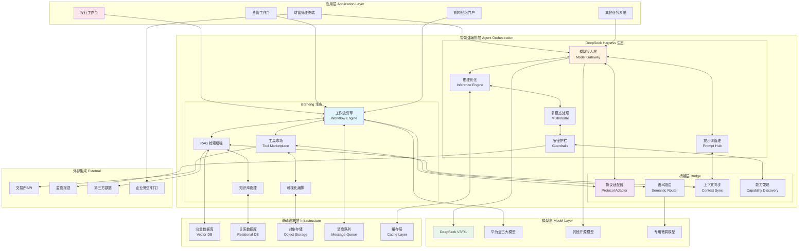

# BiSheng + DeepSeek Harness 并存架构

```mermaid
graph TB
    subgraph "应用层 Application Layer"
        A1[投行工作台]
        A2[资管工作台]
        A3[财富管理终端]
        A4[机构经纪门户]
        A5[其他业务系统]
    end

    subgraph "智能体编排层 Agent Orchestration"
        direction TB
        
        subgraph "BiSheng 生态"
            B1[工作流引擎<br/>Workflow Engine]
            B2[RAG 检索增强]
            B3[工具市场<br/>Tool Marketplace]
            B4[知识库管理]
            B5[可视化编排]
        end
        
        subgraph "DeepSeek Harness 生态"
            D1[模型接入层<br/>Model Gateway]
            D2[提示词管理<br/>Prompt Hub]
            D3[推理优化<br/>Inference Engine]
            D4[多模态处理<br/>Multimodal]
            D5[安全护栏<br/>Guardrails]
        end
        
        subgraph "桥接层 Bridge"
            BR1[协议适配器<br/>Protocol Adapter]
            BR2[语义路由<br/>Semantic Router]
            BR3[上下文同步<br/>Context Sync]
            BR4[能力发现<br/>Capability Discovery]
        end
    end

    subgraph "模型层 Model Layer"
        M1[DeepSeek V3/R1]
        M2[华为盘古大模型]
        M3[其他开源模型]
        M4[专用微调模型]
    end

    subgraph "基础设施层 Infrastructure"
        I1[向量数据库<br/>Vector DB]
        I2[关系数据库<br/>Relational DB]
        I3[对象存储<br/>Object Storage]
        I4[消息队列<br/>Message Queue]
        I5[缓存层<br/>Cache Layer]
    end

    subgraph "外部集成 External"
        E1[交易所API]
        E2[监管报送]
        E3[第三方数据]
        E4[企业微信/钉钉]
    end

    %% 应用层到编排层
    A1 --> B1
    A2 --> B1
    A3 --> D1
    A4 --> B1
    A5 --> D1
    
    %% BiSheng内部
    B1 <--> B2
    B1 <--> B3
    B2 <--> B4
    B3 <--> B5
    
    %% DeepSeek内部
    D1 <--> D2
    D1 <--> D3
    D3 <--> D4
    D4 <--> D5
    
    %% 桥接层连接
    B1 <--> BR1
    D1 <--> BR1
    B2 <--> BR3
    D2 <--> BR3
    B3 <--> BR2
    D5 <--> BR4
    
    %% 到模型层
    D1 --> M1
    D1 --> M3
    B1 --> M2
    BR2 --> M4
    
    %% 到基础设施
    B2 <--> I1
    B4 <--> I2
    D3 <--> I5
    B1 <--> I4
    B5 <--> I3
    
    %% 到外部
    B3 --> E1
    D5 --> E2
    B2 --> E3
    A3 --> E4
    
    %% 样式
    style B1 fill:#e1f5fe
    style D1 fill:#fff3e0
    style BR1 fill:#f3e5f5
    style M1 fill:#e8f5e9
    style A1 fill:#fce4ec
```
