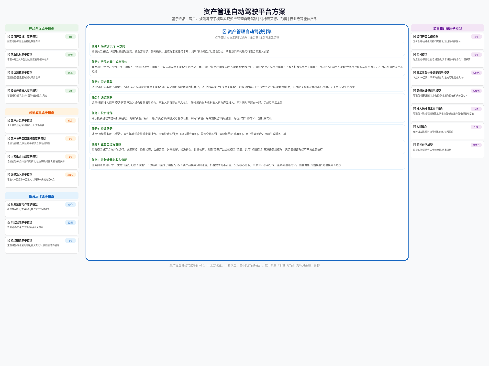

# 资产管理自动驾驶平台设计方案 v2.1

> 基于2026-09-24陶总评审要求设计。对标贝莱德、彭博，做行业级智能体产品。
> v2.0变更：调度模型改为任务调度与协同清单格式，每个任务以提示词方式设计。
> v2.1变更：兜底替换为业务计量模型；补充方案整体架构图（中间驱动引擎+两侧原子模型调用关系）。

---

## 一、设计定位

### 三个核心维度
**搭平台、研究人、研究资产**

### 平台目标
- 面向全公司、全市场开放，打破资管部部门边界
- 外部私募、投资经理、员工均可作为产品发起方
- 公司提供技术平台、交易能力、销售连接、流动性支持、牌照
- 聚合靠机制、靠产品——有了开放才有聚合

### 四维度检验标准
1. **开放性**——全员开放、向社会开放
2. **自动撮合**——自动找到资金方、资产方、合作员工
3. **议价权**——平台在公司标准之上增加议价能力
4. **贡献计量**——围绕自动化过程计量关键人贡献，找到并支持能干的人

---

## 二、原子模型清单

### 产品创设原子模型

| 模型 | 维度数 | 核心内容 |
|------|--------|---------|
| 资管产品设计原子模型 | 3维 | 配置结构 / 风险收益特征 / 期限安排 |
| 同业比对原子模型 | — | 市面十几万只资管产品蒸馏比对 |
| 收益测算原子模型 | — | 预期收益、回撤压力测试 |
| 投资经理准入原子模型 | 6维评价 | 管理规模/处罚信息/经营财务/团队实力/投资能力/风控能力 |

### 资金募集原子模型

| 模型 | 维度数 | 核心内容 |
|------|--------|---------|
| 客户分类原子模型 | — | 个人客户分层、机构客户分类 |
| 客户与资管产品匹配规则原子模型 | 5项匹配 | 合规匹配/投资能力匹配/风险偏好匹配/投资意愿匹配/投资期限匹配 |
| 资管产品内容推介生成原子模型 | 6项规则 | 合规宣传/产品特征/风险揭示/收益预期/适配说明/发行安排 |
| 渠道准入原子模型 | 2种情形 | 已准入机构（直接办产品准入）/ 新拓展机构（先办机构准入再办产品准入） |

### 公司标准规则原子模型

| 模型 | 维度数 | 核心内容 |
|------|--------|---------|
| 资管产品合规模型 | 5项合规 | 宣传内容合规/合格投资者/风险提示/适当性匹配/购买回访 |
| 资管产品总绩效计量原子模型 | 按产品类型 | 管理费/超额报酬/认申购费/销售服务费，按各模式分别定义 |
| 资管产品准入标准费率原子模型 | 5项标准 | 管理费下限/超额报酬基准/认申购费/销售服务费/业绩比较基准 |

### 投资运作原子模型

| 模型 | 维度数 | 核心内容 |
|------|--------|---------|
| 投资运作动作原子模型 | 动作 | 投资范围确认/交易执行/持仓管理/估值核算 |
| 风险监测原子模型 | 监测 | 净值回撤/集中度/流动性/合规风控线 |
| 持续服务原子模型 | 5项动作 | 定期报告/净值波动沟通/重大变化沟通/大额赎回沟通/客户咨询响应 |

### 监督和计量原子模型

| 模型 | 维度数 | 核心内容 |
|------|--------|---------|
| 资管产品合规模型 | 5项合规 | 宣传合规/合格投资者/风险提示/适当性匹配/购买回访 |
| 监督模型 | 6项监督 | 进度管控/质量检查/合规留痕/异常报警/推进督促/计量核算 |
| 资管产品员工贡献计量分配原子模型 | 按角色 | 发起人/产品设计师/募集销售人/投资经理/协作支持人 |
| 资管产品总绩效计量原子模型 | 按模式 | 管理费/超额报酬/认申购费/销售服务费/五种模式分别定义 |
| 资管产品准入标准费率原子模型 | 5项标准 | 管理费下限/超额报酬基准/认申购费/销售服务费/业绩比较基准 |

### 引擎特有模型

| 模型 | 说明 |
|------|------|
| 驱动模型 | AI提示词，定义任务触发→调度→执行逻辑 |
| 权限模型 | 以任务组为边界的语料/模型/数据权限控制 |
| 跟投评估模型 | 模式五特有，评估跟投比例和风险 |

---

## 三、任务调度与协同清单

### 3.0 方案整体架构图



> 中间为资产管理自动驾驶引擎（8个任务，驱动模型=AI提示词），左侧为产品创设原子模型、资金募集原子模型、投资运作原子模型，右侧为监督和计量原子模型。

### 任务总览

```
任务1  接收产品创设/引入意向
任务2  产品方案生成与签约
任务3  资金募集启动
任务4  渠道准入与产品上架
任务5  投资运作
任务6  持续服务
任务7  监督全过程管控
任务8  贡献计量与收入分配
```

**说明**：以上任务并发运行，无固定先后顺序。任务1-6由各事件源独立触发，任务7贯穿全程，任务8在任务闭环时触发。

---

### 任务1：接收产品创设/引入意向

**触发条件**：
- 员工举手发起（已有明确合作意向或产品设计）
- 外部投资经理提交产品方案
- 资金方（银行/机构/个人）发布资金需求
- 委外需求确认

**提示词**：

```
你是资产管理自动驾驶引擎的任务接收模块。

接收到以下类型的事件，为每个事件生成标准化任务卡片：
- 员工举手发起产品创设
- 外部投资经理提交产品方案
- 资金方发布委外/配置需求
- 合作机构（银行/渠道）提出代销意向

任务卡片必须包含：
- 任务类型：创设/引入/委外/代销
- 发起人信息（内部员工/外部机构/资金方）
- 初步意向描述
- 涉及的产品模式（五类之一）
- 时间戳和优先级标记

不要判断意向是否可行，不要过滤——所有意向都生成任务卡片并进入下一任务。
判断和过滤由后续任务的模型完成。

同时调用权限模型，为发起人创建任务组，赋予基础语料访问权限。
```

**调用原子模型**：驱动模型、权限模型

**协同关系**：输出任务卡片 → 任务2

---

### 任务2：产品方案生成与签约

**触发条件**：任务1生成的任务卡片进入

**提示词**：

```
你是资产管理自动驾驶引擎的产品方案模块。

并发执行以下动作，不分先后：

动作A——如果任务卡片包含初步产品意向：
调用"资管产品设计原子模型"（配置/风险收益/期限三维度），
调用"同业比对原子模型"对比市面同类产品，
调用"收益测算原子模型"进行收益预估和压力测试，
生成标准化产品方案初稿。

动作B——如果任务卡片是外部投资经理提交的产品：
调用"投资经理准入原子模型"（六维评价），
对产品方案进行平台适配性评估，
标记需要修改的维度。

动作C——如果任务卡片是委外需求：
调用"投资经理准入原子模型"筛选匹配的私募管理人，
调用"资管产品设计原子模型"确认产品架构，
生成委外产品方案。

动作D——所有方案生成后：
调用"资管产品合规模型"进行前置合规校验，
调用"资管产品准入标准费率原子模型"确认费率标准，
调用"资管产品总绩效计量原子模型"确定分配框架。

输出：
- 产品方案（含三维度描述）
- 合规校验结果
- 费率标准确认
- 分配框架建议
- 如不通过：标记不通过原因和调优建议（不直接拒绝）
```

**调用原子模型**：资管产品设计原子模型、同业比对原子模型、收益测算原子模型、投资经理准入原子模型、资管产品合规模型、资管产品准入标准费率原子模型、资管产品总绩效计量原子模型

**协同关系**：接收任务1输出 → 输出到任务3、任务4、任务5

---

### 任务3：资金募集启动

**触发条件**：产品方案通过评审确认可以募集

**提示词**：

```
你是资产管理自动驾驶引擎的募集调度模块。

并发执行以下动作：

动作A——客户匹配：
调用"客户分类原子模型"和"客户与资管产品匹配规则原子模型"，
自动筛选匹配的目标客户清单，
按匹配度排序。

动作B——内容生成：
调用"资管产品内容推介生成原子模型"，
为不同客户分层生成个性化推介内容，
调用"资管产品合规模型"验证推介内容合规性。

动作C——任务分派与抢单：
对有经纪关系的客户：自动派发任务给对应客户经理
对无经纪关系的客户：发布全平台抢单任务
有能力员工可主动举手认领
发起人可邀请特定员工组队

输出：
- 目标客户清单（按匹配度排序）
- 推介内容（经合规验证）
- 分派/抢单任务卡片
```

**调用原子模型**：客户分类原子模型、客户与资管产品匹配规则原子模型、资管产品内容推介生成原子模型、资管产品合规模型

**协同关系**：接收任务2输出 → 输出到任务6、任务8

---

### 任务4：渠道准入与产品上架

**触发条件**：产品方案确认需要代销渠道

**提示词**：

```
你是资产管理自动驾驶引擎的渠道管理模块。

判断渠道类型，分两种情形处理：

情形A——已准入机构（如中银理财已将公司纳入准入名单）：
直接办理产品准入手续，
调用"资管产品合规模型"确认产品满足渠道要求，
生成产品上架任务。

情形B——新拓展机构：
生成机构准入任务，
分派给渠道拓展责任人（或全平台抢单），
机构准入完成后再办理产品准入。

注意：两种情形不能混在一起处理，分别生成独立的任务卡片。

输出：
- 渠道准入任务（情形A：产品准入/情形B：机构准入+产品准入）
- 产品上架确认
```

**调用原子模型**：渠道准入原子模型、资管产品合规模型

**协同关系**：接收任务2输出 → 输出到任务5

---

### 任务5：投资运作

**触发条件**：产品成立、资金到位

**提示词**：

```
你是资产管理自动驾驶引擎的投资运作模块。

并发执行以下动作：

动作A——投资启动：
确认投资经理（或挂名投资经理），
调用"资管产品设计原子模型"确认投资范围与限制，
开放投资运作相关语料和工具权限。

动作B——风险监测：
调用"资管产品合规模型"持续监测投资运作合规性，
净值大幅回撤/触及风控线时自动报警，
报警只通知投资经理和监督模型，不干预投资决策。

动作C——估值与核算：
自动完成产品净值计算和更新，
生成投资运作日报/周报。

输出：
- 投资运作启动确认
- 风险监测报告
- 净值更新记录
```

**调用原子模型**：资管产品设计原子模型、资管产品合规模型

**协同关系**：接收任务4输出 → 输出到任务6、任务8

---

### 任务6：持续服务

**触发条件**：产品运行期间，定期或事件驱动

**提示词**：

```
你是资产管理自动驾驶引擎的持续服务模块。

以下事件均可独立触发服务任务，事件之间并发：

事件A——定期触发：
按产品频率（日/周/月/季）自动生成定期报告，
分派给服务人员执行客户沟通。

事件B——净值波动：
单日净值波动超过3%或历史回撤超过10%，
自动生成净值波动沟通任务，标记优先级为紧急。

事件C——重大变化：
产品投资经理变更/投资策略调整/管理人重大事项，
自动生成重大变化沟通任务。

事件D——大额赎回：
单月赎回超过产品规模30%或单笔超过300万，
自动生成大额赎回沟通任务，
同时触发流动性管理任务。

事件E——客户主动咨询：
客户通过任意渠道发起咨询，
自动分派给对应客户经理或服务人员。

输出：
- 服务工单（含优先级和时效要求）
- 客户沟通记录
- 异常情况升级标记
```

**调用原子模型**：持续服务原子模型、资管产品合规模型

**协同关系**：接收任务3、任务5输出 → 输出到任务8

---

### 任务7：监督全过程管控

**触发条件**：贯穿所有任务，独立运行

**提示词**：

```
你是资产管理自动驾驶引擎的监督模块。

对所有运行中的任务执行以下监督动作，动作之间并发：

监督A——进度管控：
监控每个任务的完成状态和时限，
时限临近时自动提醒，
超时未响应自动升级并通知发起人。

监督B——质量检查：
对完成的任务执行交叉验证，
调用"资管产品合规模型"进行合规留痕，
验证不通过的给出调优建议，支持重新执行。

监督C——异常报警：
实时监测异常事件（净值异常/赎回异常/合规异常），
自动标记并通知相关人员，
只报警，不干预业务执行。

监督D——计量核算：
在任务闭环时调用"资管产品员工贡献计量分配原子模型"，
计算各参与人的贡献度，
按当期/递延规则生成分配结果。

监督E——权限管理：
监控任务组成员的语料访问权限，
任务结束时自动回收权限，
记录所有访问日志。

边界：
- 只做留痕、报警、督促、核算
- 不干预投资决策
- 不参与业务执行
- 合规风控属于公共服务，不参与业务分成
```

**调用原子模型**：监督模型、资管产品合规模型、资管产品员工贡献计量分配原子模型、权限模型

**协同关系**：贯穿任务1-6全程 → 输出到任务8

---

### 任务8：贡献计量与收入分配

**触发条件**：任务闭环（产品成立/募集完成/交易达成/服务周期结束）

**提示词**：

```
你是资产管理自动驾驶引擎的计量分配模块。

根据产品模式调用对应的计量规则：

模式一（自有投资经理）：
投资经理按业绩表现提取浮动管理费分成
募集人员按实际募集金额和费率计提
产品设计师按设计贡献计提

模式二（待引入投资经理）：
引入人按产品规模和运行周期提取引入贡献
外部投资经理按协议约定提取管理费分成和超额报酬
平台运营方按平台服务费率提取

模式三（委外私募）：
筛选人按产品准入贡献计提
渠道/募集人按实际到位资金计提
投后管理人按监测质量和异常处置计提

模式四（员工设计挂名）：
产品设计师按设计贡献和产品表现计提
挂名投资经理按挂名职责和监管要求计提
募集人员按实际募集金额计提

模式五（非员工设计发行）：
发行方按协议约定提取
公司跟投按跟投收益计算
引入人按引入贡献计提
平台按平台服务费率提取

通用规则：
- 机器自动完成的动作不计量贡献
- 只拆核心链条，不是人人分钱
- 中后台公共服务人员不参与分成
- 当期与递延结合，具体比例按产品类型确定
- 状态是给机器看的，计量是给人算的，两者分开
```

**调用原子模型**：资管产品员工贡献计量分配原子模型、资管产品总绩效计量原子模型、跟投评估模型

**协同关系**：接收任务3、任务5、任务6、任务7输出 → 生成分配结果

---

## 四、五类产品模式适配

### 适配总览

| 模式 | 产品发起方 | 核心特征 | 计量重点 | 涉及任务 |
|------|-----------|---------|---------|---------|
| 模式一：自有投资经理 | 公司投资经理 | 主动管理、业绩导向 | 投资业绩+募集贡献 | 任务1→2→3→5→6→8 |
| 模式二：待引入投资经理 | 外部投资经理 | 已设计产品、待入职 | 引入贡献+投资业绩 | 任务1→2→3→5→6→8 |
| 模式三：委外私募 | 外部私募机构 | 投向私募产品 | 筛选贡献+渠道贡献 | 任务1→2→3→5→6→8 |
| 模式四：员工设计挂名 | 公司员工 | 员工发起、合规投资经理挂名 | 设计贡献+募集贡献 | 任务1→2→3→5→6→8 |
| 模式五：非员工设计发行 | 外部机构/个人 | 需公司跟投机制 | 跟投贡献+平台服务 | 任务1→2→3→4→5→6→8 |

### 各模式差异说明

**模式一（自有投资经理）**
- 任务1触发：投资经理发起或业务部门发起募集需求
- 任务2特点：直接调用产品设计模型生成方案，投资经理全程参与
- 任务8重点：投资经理按业绩浮动分成，募集人员按金额计提

**模式二（待引入投资经理）**
- 任务1触发：引入人举手发起，提交外部投资经理的产品方案
- 任务2特点：需额外调用投资经理准入模型进行六维评价，产品需做平台适配性改造
- 任务8重点：引入人按产品规模和运行周期提取引入贡献

**模式三（委外私募）**
- 任务1触发：资金方确认委外投向需求
- 任务2特点：核心是私募筛选（六维评价），产品架构由公司设计
- 任务8重点：筛选人按准入贡献计提，投后管理人按监测质量计提

**模式四（员工设计挂名）**
- 任务1触发：员工举手发起产品设计
- 任务2特点：需匹配挂名合规投资经理，设计师对产品负实质责任
- 任务8重点：设计师按设计贡献和产品表现计提，挂名投资经理按合规职责计提

**模式五（非员工设计发行）**
- 任务1触发：外部机构提交方案或员工引入
- 任务2特点：需额外调用跟投评估模型确定跟投比例
- 任务4特点：风险最高，需更严格的渠道审查
- 任务8重点：发行方按协议提取，公司按跟投收益计算

---

## 五、业务计量模型

> 体现平台化公平机制，各参与人按贡献合理分配收益。状态与计量分离，机器完成的不计量，中后台公共服务不参与分成。

### 5.1 计量原则

| 原则 | 说明 |
|------|------|
| 状态与计量分离 | 任务状态给机器看，计量模型给人算，两者独立运行 |
| 机器完成不计量 | AI自动完成的动作不产生贡献计量 |
| 只拆核心链条 | 计量聚焦关键角色核心贡献，不是人人分钱 |
| 中后台不分 | 合规、风控等公共服务人员不参与业务分成 |
| 当期+递延 | 分配结合当期发放和递延支付，具体比例按产品类型确定 |
| 平台化公平 | 同一角色同一贡献标准，不因部门/资历/关系而异 |

### 5.2 计量角色与分配框架

| 角色 | 计量内容 | 分配依据 | 适用模式 |
|------|---------|---------|---------|
| **发起/引入人** | 引入资金方、资产方、渠道方、外部投资经理 | 按引入产品规模×运行周期×引入费率 | 全模式 |
| **产品设计师** | 产品方案设计、配置结构、风险收益特征 | 按设计贡献比例×产品表现 | 模式一/二/四 |
| **募集销售人** | 实际募集资金 | 按募集金额×销售费率 | 全模式 |
| **投资经理** | 投资运作管理、业绩表现 | 按业绩基准提取管理费分成+超额报酬 | 模式一/二/四 |
| **筛选评估人** | 私募管理人筛选、委外产品评估 | 按准入贡献×产品规模 | 模式三/五 |
| **投后管理人** | 投后监测、异常处置、持续报告 | 按监测质量×服务周期 | 模式三 |
| **协作支持人** | 专业支持（法务/合规咨询等） | 按支持贡献一次性或按期计提 | 全模式 |
| **平台运营方** | 平台技术支撑、交易能力、牌照服务 | 按平台服务费率从产品收入中提取 | 全模式 |

### 5.3 五类产品模式计量适配

**模式一（自有投资经理）：**

| 参与人 | 计量来源 | 分配方式 | 说明 |
|--------|---------|---------|------|
| 投资经理 | 管理费+超额报酬 | 浮动分成，业绩好拿得多 | 核心角色，负全责 |
| 募集销售人 | 实际募集金额 | 按费率计提 | 全员可参与 |
| 产品设计师 | 设计贡献 | 按贡献比例 | 如非投资经理本人 |
| 平台运营方 | 平台服务费率 | 从产品收入中提取 | 固定比例 |

**模式二（待引入投资经理）：**

| 参与人 | 计量来源 | 分配方式 | 说明 |
|--------|---------|---------|------|
| 引入人 | 引入产品规模×运行周期 | 引入费率计提 | 全程牵头，风险最高 |
| 外部投资经理 | 管理费+超额报酬 | 按协议约定 | 入职或挂名 |
| 募集销售人 | 实际募集金额 | 按费率计提 | 全员可参与 |
| 平台运营方 | 平台服务费率 | 从产品收入中提取 | 固定比例 |

**模式三（委外私募）：**

| 参与人 | 计量来源 | 分配方式 | 说明 |
|--------|---------|---------|------|
| 筛选评估人 | 准入贡献×产品规模 | 一次性+持续计提 | 筛选质量决定成败 |
| 募集销售人 | 实际到位资金 | 按费率计提 | 渠道拓展 |
| 投后管理人 | 监测质量×服务周期 | 按期计提 | 异常处置能力 |
| 平台运营方 | 平台服务费率 | 从产品收入中提取 | 固定比例 |

**模式四（员工设计挂名）：**

| 参与人 | 计量来源 | 分配方式 | 说明 |
|--------|---------|---------|------|
| 产品设计师（员工） | 设计贡献×产品表现 | 浮动比例 | 对产品负实质责任 |
| 挂名投资经理 | 挂名合规职责 | 固定比例 | 履行监管要求 |
| 募集销售人 | 实际募集金额 | 按费率计提 | 全员可参与 |
| 平台运营方 | 平台服务费率 | 从产品收入中提取 | 固定比例 |

**模式五（非员工设计发行，需跟投）：**

| 参与人 | 计量来源 | 分配方式 | 说明 |
|--------|---------|---------|------|
| 发行方（外部） | 协议约定 | 按协议 | 风险最高模式 |
| 公司跟投 | 跟投收益 | 按跟投比例×产品表现 | 风险共担 |
| 引入人 | 引入贡献 | 按引入费率 | 全程牵头 |
| 募集销售人 | 实际募集金额 | 按费率计提 | 全员可参与 |
| 平台运营方 | 平台服务费率 | 从产品收入中提取 | 固定比例 |

### 5.4 平台化公平机制

**公平保障：**
- 所有计量规则在平台上公开透明，任何员工可查询
- 同一角色适用同一费率标准，不因部门/资历/关系而异
- 计量结果实时可查，分配过程可追溯
- 引入人、设计师、销售人员的贡献交叉验证，防止虚报

**争议处理：**
- 计量争议由监督模型自动复核
- 复核结果作为下次计量规则优化的输入
- 重大争议提交AI委员会仲裁

**动态调优：**
- 计量规则随业务运行数据持续优化
- 每季度根据实际分配效果校准费率
- 新型业务模式的计量规则由AI委员会审定后上线

---

## 六、开放性与平台化设计

### 开放性分级

| 层级 | 范围 | 权限 |
|------|------|------|
| 第一层 | 公司内部全员 | 参与产品设计、募集、协作 |
| 第二层 | 公司认证外部投资经理 | 发起产品、参与投资运作 |
| 第三层 | 合作机构（银行/私募） | 产品代销、委外合作 |
| 第四层 | 全市场（未来） | 行业级智能体产品，对外开放 |

---

> v2.0基于零售业务自动驾驶引擎格式重构。任务调度与协同清单+提示词方式设计。
> 驱动模型=AI提示词。状态与计量分离。全部并发无流程。一套方法论、一套模型、套不同产品特征。
